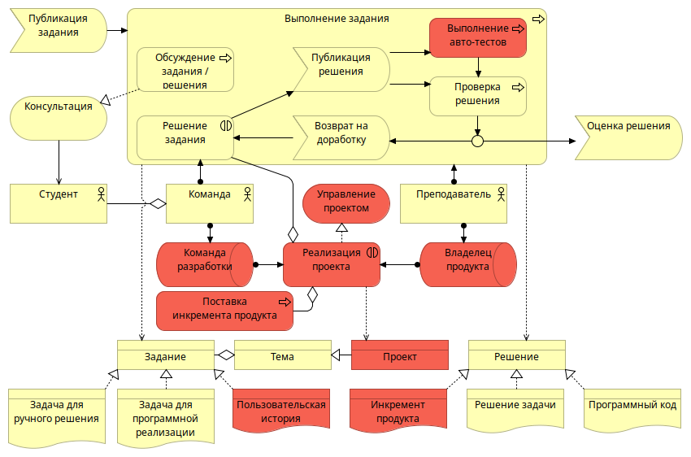
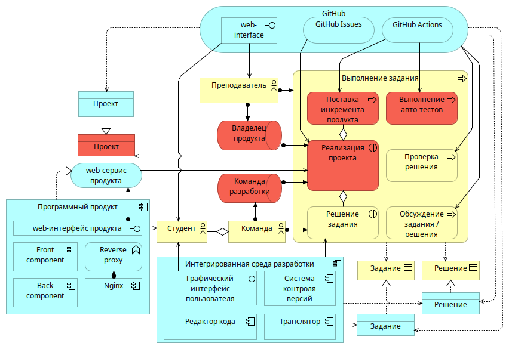
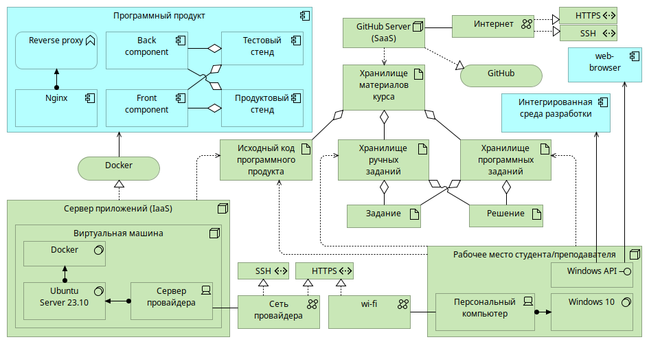

# Применение архитектурного подхода для разработки платформы проведения практических занятий по программированию
## Введение
В настоящее время IT-сфера активно развивается и требует от специалистов не только высокой квалификации, но и навыков работы в команде над реальными проектами. Однако учебные задачи, предлагаемые в рамках образовательных программ, часто недостаточно практико-ориентированы и не дают студентам необходимого опыта для успешного участия в реальных проектах.

Опыт участия в проектах и навыки командной работы выделены как критерии качества подготовки студентов, которые являются важными для работодателя на основе анализа публикаций. В статье журнала БИТ "Как и чему учить будущих звезд ИТ?" \[1] опрашиваемые представители ИТ-индустрии отмечали важность проектной и командной работы для подготовки кадров. Так Юлия Шикова, директор учебного центра "Сетевая Академия ЛАНИТ", отметила, что опыт реализации проектов повышает конкурентоспособность выпускников на рынке труда. По мнению Алены Дядченко, руководителя разработки компании Granatum Solutions, подготовка ИТ-специалистов в России "мало соответствует последним трендам и технологиям" вследствие чего, при трудоустройстве важную роль играет опыт, в том числе опыт разработки, например, в open-source проектах. По словам Андрея Бороздюхина, директора саратовского филиала компании Bell Integrator, для ИТ-специалистов необходимо уметь работать в команде и участвовать в коллективной разработке. В статье "Анализ пробелов в навыках после пандемии COVID" \[2] исследуются востребованность работодателями различных навыков и возможности учебных программ политехнического колледжа Торонто (Humber College) по подготовке конкурентоспособных специалистов. На основе собранных данных, в качестве наиболее востребованных указаны навыки коммуникации, а навыки командной работы заняли четвертое место в рейтинге.

В рамках данной работы проведено моделирование архитектуры платформы для проведения практических занятий по дисциплине «Алгоритмы и структуры данных», использование которой позволит студентам развить универсальные и общепрофессиональные компетенции, в том числе:
- разработка и реализация проектов,
- командная работа и лидерство,
- способность разрабатывать алгоритмы и программы, пригодные для практического использования.

Для выбора подходов и инструментов моделирования проведен анализ публикаций по описанию и сравнению различных методологий описания архитектуры предприятия. В работах Борреманс А. Д. \[3] и Сынбулатовой А. Т. \[4] проводится сравнение методологий TOGAF(The Open Group Architecture Framework), Zachman (Захман), Gartner и некоторых других. В работах Скрипкин К.Г. \[5] и Сапожникова А. Ю.\[6] описывается опыт применения методологии TOGAF для моделирования архитектуры образовательной организации. В работе Кнышова В. А. \[7] описывается язык моделирования ArchiMate, разрабатываемый The Open Group, подходящий для методологии TOGAF. На основе изученных публикаций в качестве подходящей выбрана методология TOGAF, в качестве языка моделирования ArchiMate. 

TOGAF позволяет описывать архитектуру в контексте четырех доменов:
- бизнес-архитектура,
- архитектура данных,
- архитектура приложений,
- технологическая архитектура.

Ядром TOGAF является метод разработки архитектуры (ADM - Architecture Development Method), в рамках которого описываются текущее и желаемое состояние архитектуры предприятия и осуществляется переход от текущего к желаемому состоянию посредством фаз архитектурного цикла.

Язык ArchiMate \[6] позволяет моделировать архитектуру предприятия согласно методу ADM, при этом для языка доступен кроссплатформенный редактор с открытым исходным кодом и возможностью экспорта моделей в различные форматы, в том числе в формат HTML.

## Анализ предметной области
В работе рассматривается процесс проведения семинарских занятий по курсу «Алгоритмы и структуры данных» в НИУ Высшая школа экономики в Перми. В занятиях участвуют студенты второго курса направления «Разработка информационных систем». Для семинарских занятий студенты объединяются в команды и совместно выполняют задания. На каждом занятии студентам предлагается задание, которое они выполняют в составе команды. Предусмотрены задания двух видов — написание программного кода и решение задачи с использованием заданного алгоритма.

Существующая реализация процесса проведения семинарских занятий имеет следующие недостатки:
- Значительная часть заданий курса связана с написанием программного кода, при этом возможности автоматической проверки кода не используются, преподаватель вынужден проверять все решения вручную.
- К программному коду, который пишут студенты не сформулированы понятные и четкие требования как по структуре программы, так и по оформлению.
- Решения студентов не сохраняются, в связи с чем сложно контролировать оригинальность решения — команды, сдающие работы с запозданием, зачастую показывают решения идентичные тем, что были сданы ранее.
- Слабая практическая направленность курса — работы студентов имеют мало общего с примерами реализации алгоритмов для реальных проектов.

С целью устранения указанных недостатков планируется разработать платформу для проведения практических занятий, которая позволит хранить материалы курса, автоматически проверять решения, связанные с написанием программного кода. Для решения практико-ориентированных задач предполагается включить в состав платформы программный продукт, в разработке и сопровождении которого могут участвовать студенты, приобретая тем самым навыки проектной и командной работы и опыт участия в реальном проекте.

Для разработки и сопровождения программного продукта планируется использовать методологию DevOps, для чего изучены соответствующие публикации. В статье "Оптимальный подход к разработке программного обеспечения с использованием современных методологий и технических средств" \[9] автор описывает современные требования, как к процессу разработки программного обеспечения, так и к инфраструктуре, в частности автор указывает на необходимость применения быстрых и удобных инструментов для установки, поддержки и обновления разрабатываемого программного обеспечения. Применение методологии DevOps, включающей автоматизацию процесса тестирования, сборки и поставки продукта, позволит упростить участие студентов в разработке и снизить требования к специфическим навыкам студентов. Аналогичный опыт применения методологии DevOps описывается в работе "DEVOPS как механизм быстрого погружения в ИТ-проект" \[10] - студенты привлекались к участию в разработке web-приложения "Электронные сервисы вуза" для Омского государственного университета, автоматизация процессов сборки приложения студенты смогли эффективно выполнить поставленные задачи и получили опыт участия в реальном проекте.

Кроме того, изучены статьи по теме организации проектной работы студентов, например, "Модель формирования социальной компетентности у будущих программистов в условиях коллаборативного электронного обучения" \[11]. В этой статье авторы предлагают использовать гибкую методологию Agile и технологию Scrum для управления учебным проектом. Для хостинга проекта авторы предлагают использовать платформу GitHub. В работе "Методологии управления программными проектами в подготовке IT-специалистов" \[12] автор отмечает важность изучения студентами вопросов управления программными проектами и в качестве наиболее эффективных технологий управления программными продуктами выделяет Agile и Scrum. Перспективным направлением использования Scum в вузах в статье \[12] представляется выполнение студентами сквозных междисциплинарных проектов с привлечением студентов старших курсов для работы в роли скрам-мастеров. В работе "Научить студента думать: Scrum как метод продуктивного обучения в учебном заведении" \[13] рассматриваются возможности использования Scrum, как метода продуктивного обучения. Продуктивное обучение предполагает создание в ходе образовательной деятельности некоторого продукта - идеи, схемы, модели, текста и т.д. \[13]. Методология Scrum, по мнению автора, является одной из наиболее эффективных в подготовке студентов к обучению на протяжении всей жизни и формирования востребованных навыков. С указанными публикациями можно согласиться в том, что гибкая методология Agile и фреймворк Scrum являются современными, эффективными для управления проектами по разработке программных продуктов.

## Моделирование архитектуры предприятия
На основе анализа предметной области и соответствующих публикаций с помощью языка ArchiMate разработана модель архитектуры и представления модели, характеризующие предметную область с различных точек зрения в разрезе доменов архитектуры TOGAF (бизнес, данные, приложения, технологическая архитектура). Разработаны представления для описания заинтересованных лиц и их мотивации, организационной структуры организации, рассматриваемых процессов до и после внесения изменений. Разработанное представление, описывающее процесс выполнение задания после внедрения платформы изображено на рис. 1.

Представление иллюстрирует, что планируемые изменения практически не меняют существующие процессы, а лишь добавляются новые формы их реализации, вводятся новые роли для участников, в контексте управления проектом с использованием фреймворка Scrum. Преподаватель публикует задание, после чего студенты в составе команды приступают к его решению. После предоставления готового решения, выполняются автоматические тесты, если задание предполагает написание программного кода, и проверка решения преподавателем. В результате проверки преподаватель оценивает решение, либо возвращает его на доработку. Также преподаватель проводит консультации, если у студентов возникают вопросы по выполнению задания.

**Рисунок 1 - Представление Выполнение задания.**

Красным цветом на представлении выделены элементы, которые планируется внедрить в ходе реализации изменений. Так решение задания может быть реализовано в виде программного проекта, в котором команда студентов выступает в роли команды разработки, а преподаватель в роли владельца продукта. Задание в этом случае может быть представлено в виде некоторой пользовательской истории, запрашивающей расширение функциональности продукта. Решение такого задания в итоге будет представлять инкремент продукта - версия разрабатываемого продукта, готовая к использованию и увеличивающая его ценность для конечных пользователей. Инкремент автоматически поставляется на стенды программного продукта. Кроме того добавляется новый сервис - Управление проектом, позволяющий проводить контроль реализации проекта. 

Для моделирования поддержки описанных процессов разработано представление Приложения, изображенное на рисунке 2, которое описывает как приложения взаимодействуют между собой и используются для поддержки бизнес-процессов.

**Рисунок 2 - Представление Приложения**

Представление иллюстрирует, что для поддержки процесса выполнения заданий используется сервис GitHub. Задания и решения публикуются в репозитории на хостинге GitHub, для выполнения автотестов используется сервис GitHub Actions. Тесты запускаются автоматически на виртуальной машине GitHub, при публикации студентами решения. Для подготовки решения, связанного с написанием программного кода, студенты используют интегрированную среду разработки.

Красным цветом на представлении выделены процессы, которые планируется внедрить в ходе реализации изменений. Для поддержки внедряемого процесса Реализация проекта планируется использовать сервис GitHub Issues, позволяющий организовать управление проектом по выполнению заданий курса и развитию программного продукта, исходные коды которого также размещены в репозитории на сервисе GitHub. Проект предполагает разработку и поддержку программного продукта, в связи с чем, на представление вынесены приложения, составляющие программный продукт и сервис, который это продукт реализует.

Для моделирования использования инфраструктуры разработано представление Технологии, изображенное на рисунке 3. Представление иллюстрирует, как приложения поддерживаются программными и аппаратными технологиями.

**Рисунок 3 - Представление Технологии**

Рабочие места преподавателя и студентов представляю собой персональные компьютеры с доступом в сеть интернет. На компьютерах установлена интегрированная среда разработки, включающая в себя систему управления версиями и браузер для  взаимодействия с web-сервисами. Репозитории с заданиями курса и исходным кодом программного продукта клонируются на компьютеры преподавателя студентов, организация совместной работы с материалами курса реализуется с помощью распределенной системы управления версиями и интегрированной среды разработки. Браузер используется для работы в проекте на web-сервисе GitHub и взаимодействия с web-сервисом разрабатываемого программного продукта по протоколу HTTPS. 

Разрабатываемый программный продукт, представлен набором компонентов и для его поддержки необходимо арендовать виртуальную машину, установить на нее операционную систему Ubuntu Server, платформу для контейнеризации приложений Docker. Виртуальная машина с сервисом Docker, представляет собой узел Сервер приложений, который позволит развернуть и поддерживать разрабатываемый программный продукт. Программный продукт будет реализовывать web-сервис, построенный на клиент-серверной архитектуре, соответственно основными компонентами продукта являются клиентская часть, обозначенная как Frontend и серверная часть, обозначенная как Backend. Программный продукт развертывается на двух стендах - продуктовом, основной сервис для конечного пользователя, и тестовом, сервис, на котором студенты могут отлаживать и тестировать изменения. Для поддержки двух стендов компоненты Frontend и Backend должны содержать продуктовую и тестовую версию, кроме того продукт должен включать в себя обратный прокси сервер, для маршрутизации клиентских запросов между стендами и компонентами. Все компоненты программного продукта будут использоваться в виде Docker-контейнеров, то есть на узле Сервер приложений достаточно установить платформу Docker.

Сервер приложений разворачивается на виртуальной машине, арендованной у одного из облачных провайдеров,  по модели IaaS (Infrastructure as a Service — инфраструктура как услуга), согласно которой провайдером предоставляются информационно-технологические ресурсы — виртуальные серверы с заданной вычислительной мощностью, операционной системой и доступом к сети. Обновление стендов программного продукта происходит автоматически под управлением сервера GitHub по протоколу SSH.

Сервер GitHub предоставляет услуги по хостингу проектов по модели SaaS (Software as a Service — программное обеспечение как услуга), согласно которой провайдером предоставляется готовое прикладное программное обеспечение, полностью обслуживаемое провайдером. 

На хостинге GitHub размещается хранилище материалов курса, включающее в себя хранилище ручных заданий, хранилище программных заданий и исходного кода программного продукта. Хранилища представляют собой репозитории, находящиеся под управлением системы контроля версий Git.

Сервер предоставляет возможности по управлению проектами посредством сервиса GitHub Issues. Проект позволяет создавать задачи с необходимым набором полей для хранения данных, связывать их с репозиториями и участниками проекта, контролировать ход выполнения задач, выводить аналитические данные по проектам в различных представлениях, в том числе в виде канбан-доски и диаграммы Ганта.

Кроме того, GitHub предоставляет сервис GitHub Actions, позволяющий реализовывать процессы непрерывной интеграции и непрерывного развертывания по методологии DevOps.  Сервис GitHub Actions будет использоваться для запуска авто-тестов для решений, предполагающих написание программного кода. Тесты будут автоматически запускаться при публикации студентами решения. Также сервис будет использоваться для автоматического обновления стендов программного продукта после внесения изменений в его исходный код.

Таким образом, структура платформы для проведения практических занятий по дисциплине «Алгоритмы и структуры данных» включает в себя следующие компоненты:
- Рабочие места преподавателя и студентов;
- Сервер приложений, на котором развернуты тестовый и продуктовый стенды программного продукта;
- Сервер GitHub, осуществляющий хостинг проекта.

Взаимодействие между рабочими местами и серверами осуществляется по протоколу HTTPS. Взаимодействие между сервером GitHub и сервером приложений осуществляется по протоколу SSH.

## Заключение
В результате проведенного анализа процесса проведения семинарских занятий по дисциплине «Алгоритмы и структуры данных» с помощью языка моделирования ArchiMate разработана модель предметной области, описана организационная структура и бизнес процессы, а также архитектура платформы для проведения практических занятий, использование которой позволит студентам развить универсальные и общепрофессиональные компетенции.

Описанная платформа разработана и используется для проведения занятий в учебном году 2023/24 гг. В качестве программного продукта в состав платформы включено web-приложение онлайн калькулятор для различных алгоритмов, содержащее каталог алгоритмов с возможностью выполнения алгоритма с заданными параметрами. Расширение функционала онлайн калькулятора проводится посредством добавления новых алгоритмов. Практические задания предполагающие программную реализацию определенного алгоритма по желанию студентов выполняются в формате разработки программного модуля для онлайн калькулятора. 

## Список источников
1. Никонова, Е. З. Как и чему учить будущих звезд ИТ? // БИТ. БИЗНЕС & ИНФОРМАЦИОННЫЕ ТЕХНОЛОГИИ. – 2020. – № 7(100). – С. 38-52.
2. Barath Roy Michel, Manivannan Kannan, Aarthi Rajam Subramanian, Piyusha Lokre, Gianfranco Alvarado A Study on Skills Gap: Beyond COVID // Journal of Innovation in Polytechnic Education. - 2022. - № 4 (1). – С. 57-61.
3. Борреманс, А. Д. Методологии построения бизнес-архитектуры предприятия / А. Д. Борреманс, А. А. Мулишова // Современные вопросы устойчивого развития общества в эпоху трансформационных процессов : Сборник материалов V Международной научно-практической конференции, Москва, 31 января 2023 года. – Москва: Общество с ограниченной ответственностью "Издательство АЛЕФ", 2023. – С. 171-176.
4. Сынбулатова, А. Т. Анализ и сравнение методологий по моделированию архитектуры предприятия / А. Т. Сынбулатова // Бенефициар. – 2021. – № 90. – С. 28-32.
5. Скрипкин К.Г. Влияние внешней среды на организационный дизайн образовательного учреждения: инструменты анализа // Современные информационные технологии и ИТ-образование. 2016. №3-2. URL: https://cyberleninka.ru/article/n/vliyanie-vneshney-sredy-na-organizatsionnyy-dizayn-obrazovatelnogo-uchrezhdeniya-instrumenty-analiza (дата обращения: 14.01.2024).
6. Сапожников А. Ю. Управление знаниями на примере машиностроительного предприятия и ВУЗа / А. Ю. Сапожников, Г. Г. Куликов, А. А. Кузнецов, М. В. Юрлов // Вестник Южно-Уральского государственного университета. Серия: Компьютерные технологии, управление, радиоэлектроника. – 2022. – Т. 22, № 2. – С. 148-157. – DOI 10.14529/ctcr220214.
7. Кнышов, В. А. Archimate как средство описания архитектуры предприятия / В. А. Кнышов, А. В. Свищев // Моя профессиональная карьера. – 2023. – Т. 3, № 48. – С. 24-29.
8. ArchiMate® 3.2 Specification [Электронный ресурс] // Официальный сайт Спецификация Archimate от консорциума The Open Group. URL: https://pubs.opengroup.org/architecture/archimate3-doc/ (дата обращения 15.01.2023).
9. Лазарева, Н. Б. Оптимальный подход к разработке программного обеспечения с использованием современных методологий и технических средств / Н. Б. Лазарева // Инженерный вестник Дона. – 2020. – № 10(70). – С. 54-63.
10. Коляда, Н. В. DEVOPS как механизм быстрого погружения в ИТ-проект / Н. В. Коляда // Молодёжь третьего тысячелетия : Сборник научных статей, Омск, 10–28 апреля 2017 года. – Омск: Омский государственный университет им. Ф.М. Достоевского, 2017. – С. 820-822.
11. Гороховская, Н. А. Модель формирования социальной компетентности у будущих программистов в условиях коллаборативного электронного обучения / Н. А. Гороховская, Л. Н. Рулиене // Проблемы современного образования. – 2018. – № 5. – С. 209-217.
12. Никонова, Е. З. Методологии управления программными проектами в подготовке IT-специалистов / Е. З. Никонова // . – 2018. – Т. 9, № 2-2. – С. 167-173.
13. Лукашенко, М. А. Научить студента думать: SCRUM как метод продуктивного обучения в учебном заведении / М. А. Лукашенко, Т. В. Телегина // Азимут научных исследований: педагогика и психология. – 2019. – Т. 8, № 2(27). – С. 138-142.
